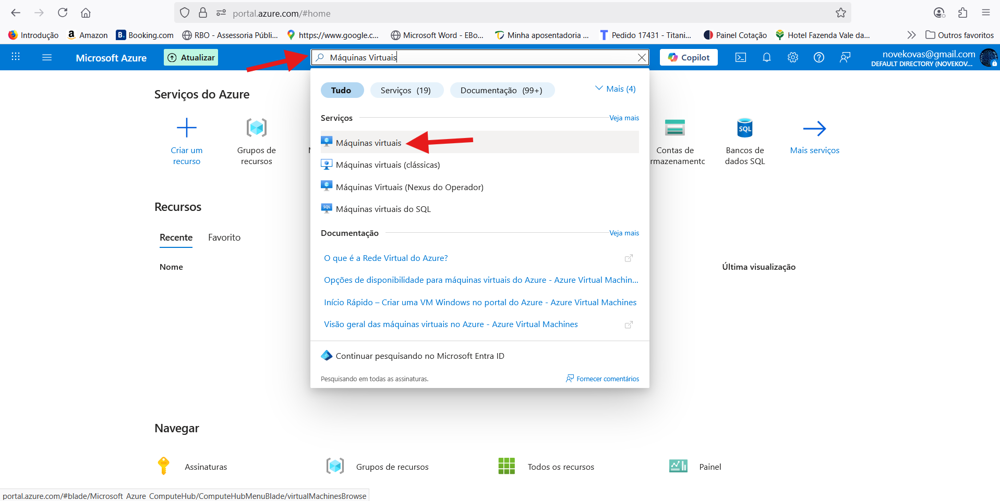
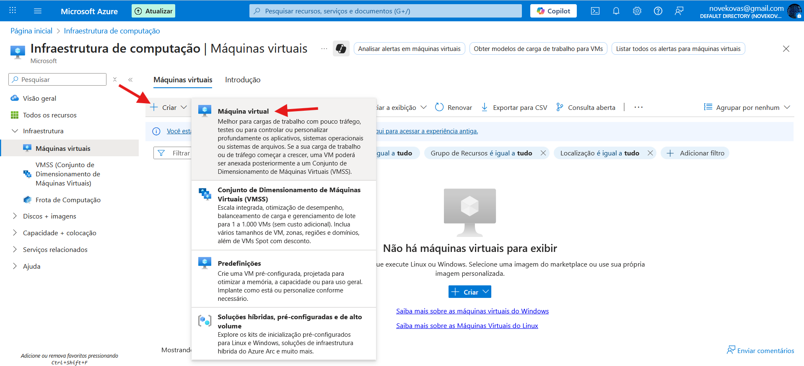

# Criando Máquina Virtual no Microsoft Azure

Este documento tem como finalidade **documentar o processo básico para a criação de máquinas virtuais via portal do Microsoft Azure**.  

---

## 📌 Pré-requisitos
- Conta ativa no [Microsoft Azure](https://portal.azure.com/)  
- Permissão para criar recursos na assinatura desejada  

---

## 🚀 Passo a passo para criação da VM

### 1) Acessar o portal do Microsoft Azure
Entre no portal clicando no link:  
👉 [https://portal.azure.com/](https://portal.azure.com/)

---

### 2) Acessar o serviço de Máquinas Virtuais
No menu de pesquisa do portal, digite **“Máquinas Virtuais”** e clique no serviço **Máquinas Virtuais**.  

---

### 3) Criar uma nova máquina virtual
Assim que abrir o painel do serviço **Máquinas Virtuais**, clique em **Criar** e selecione **Máquina Virtual**.  

---

### 4) Informações mínimas para criação de uma VM Windows
Durante a configuração, preencha os campos obrigatórios:

- 4.01) **Assinatura** → em qual assinatura o recurso será alocado  
- 4.02) **Grupo de recurso** → grupo onde os objetos da VM serão criados  
- 4.03) **Nome da máquina virtual**  
- 4.04) **Região** → região geográfica onde o recurso será criado  
- 4.05) **Imagem** → sistema operacional da VM (ex.: Windows Server, Ubuntu, etc.)  
- 4.06) **Tamanho** → capacidade computacional (CPU e memória RAM)  
- 4.07) **Nome de usuário** → conta de administrador local da VM  
- 4.08) **Senha e confirmar senha** → senha para o administrador local  
- 4.09) **Portas de entrada públicas** → definir se haverá acesso via internet  
- 4.10) **Seleção de portas de entrada** → caso habilitado, definir quais portas serão acessíveis (ex.: RDP, SSH)  

---

## 📖 Referências
- [DIO - Formação Microsoft AZ-900 Certification](https://web.dio.me/track/formacao-microsoft-az-900-certification)
- [Documentação oficial do Azure - Criar máquinas virtuais](https://learn.microsoft.com/pt-br/azure/virtual-machines/windows/quick-create-portal)  

---

✍️ Autor: [Ivan Kovalinkinas](https://github.com/ivankovalinkinas)  

